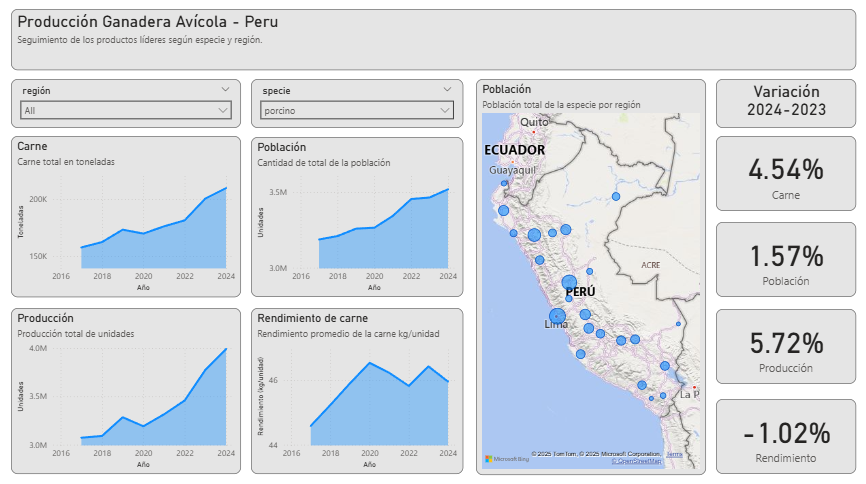

# Agro-industrial production in Peru

### 📊 **Livestock Production and Population Dashboard in Peru**

Using data from **MIDAGRI**, we analyze the evolution of **meat production 🥩, animal population 🐄, total production 📈, and yield** by **species and region** over the years. This dashboard shows how these indicators **change over time** and their **variation compared to the previous year**, allowing an easy exploratory analysis.

With this information, you can:

* Identify **growth or decline trends** by species 📉📈
* Compare **regional differences** in population and production 🗺️
* Detect **regions or species with high or low performance**
* Support **planning, policy, or investment decisions** in the agricultural sector 🌱

For example, the dashboard shows that the **llama population has been decreasing** in recent years, with **Puno** being the region with the **highest llama population**. On the other hand, the **porcine (pig) species 🐖 has shown a consistent increase** in population, meat, and production. Most regions have a strong presence of porcines, with **Lima and Huánuco** standing out, which can be clearly observed on the **map visualization**.

